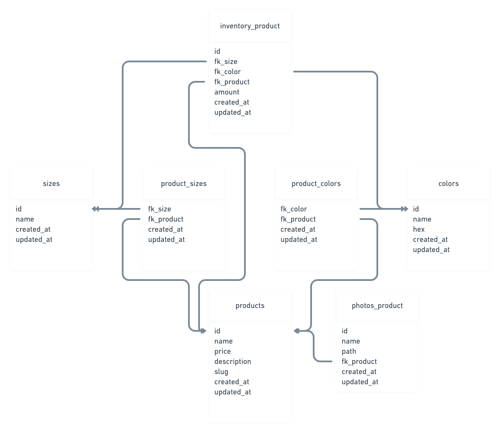

  

    

> ### API RESTful criada para o teste técnico da [Houpa](https://houpa.app)

----------

# Vamos começar

## Dependências

- [jwt-auth](https://github.com/tymondesigns/jwt-auth) - Para autenticação foi usado o JSON Web Tokens
- [Amazon S3](https://aws.amazon.com/s3/) - Para o upload das fotos dos produtos foi usado o Amazon S3

## Instalação

Faça o clone do repositório

    git clone https://github.com/viniciusanchieta/test-houpa.git

Acesse a pasta

    cd test-houpa

Instale todas as dependências utilizando o composer

    composer install

Copie o arquivo env de exemplo e faça as alterações de configuração necessárias no arquivo .env

    cp .env.example .env

Gere uma nova chave do application key

    php artisan key:generate

Gere uma nova chave secreta de autenticação JWT

    php artisan jwt:generate

Execute as migrações do banco de dados (**Defina a conexão do banco de dados em .env antes de migrar**)

    php artisan migrate

Inicie o servidor de desenvolvimento local

    php artisan serve

# Estrutura do banco de dados

  

# Agradecimentos

### Foi um projeto sensacional!
### Agradeço muito pela oportunidade e espero que vocês tenham gostado.
### Um grande abraço e estou ansioso para o feedback!
